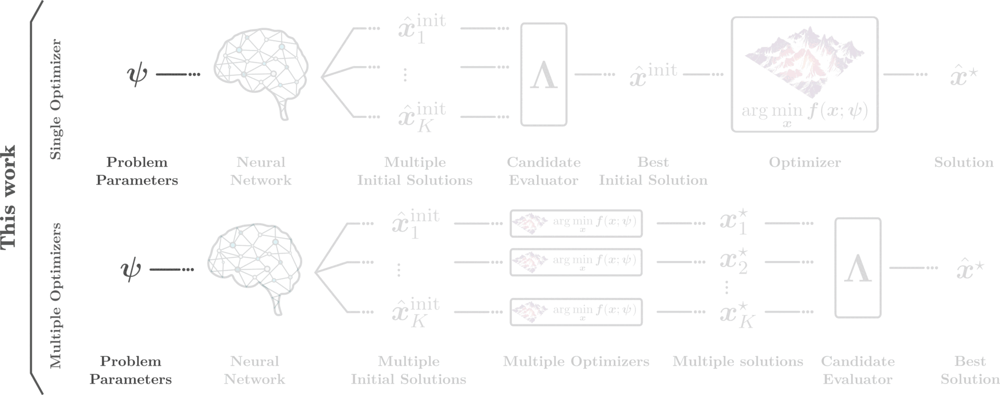

#  MISO: Learning Multiple Initial Solutions to Optimization Problems

[](https://esharony.me/projects/miso/)
[](https://arxiv.org/abs/2411.02158)
[](https://esharony.me/projects/miso/)
[](https://www.python.org/)
[](https://pytorch.org/)
[](LICENSE)

**[Project page](https://esharony.me/projects/miso/)** · **[Paper (arXiv)](https://arxiv.org/abs/2411.02158)** · **[Citation](#citation)**

> Train **one** network that predicts **many** diverse initial solutions, so a local optimizer can escape poor warm starts and reach near-global optima — at nearly constant inference cost.

<p align="center" width="100%">
  
</p>

This repository contains the official code for **[Learning Multiple Initial Solutions to Optimization Problems](https://arxiv.org/abs/2411.02158)** by Elad Sharony, Heng Yang, Tong Che, Marco Pavone, Shie Mannor, and Peter Karkus — **accepted to ICRA 2026**.

The core idea of &nbsp; **MISO** is to train a single neural network to predict *multiple* initial solutions to an optimization problem, such that the predictions cover promising regions of the optimization landscape, allowing a local optimizer to find a solution close to the global optimum.

## Highlights

- **One model, many initial solutions.** Predict `K` candidate initial solutions in a single forward pass instead of training and running an ensemble.
- **Two deployment modes.** Either select the most promising candidate and run a single optimizer, or initialize multiple optimizers in parallel and keep the best final solution.
- **Diversity-aware training.** Winner-takes-all, pairwise-distance, and mixed objectives explicitly encourage the network to cover multiple modes.
- **Guaranteed no worse than the baseline.** Including the default warm start among the candidates means MISO performs at least as well as warm-starting.
- **Nearly constant inference time.** Unlike ensembles, MISO's inference time stays roughly flat as `K` grows.
- **Robotics benchmarks.** Cart-pole (Box-DDP), reacher (MPPI), and autonomous driving on nuPlan (iLQR).

## Results

Mean cost (lower is better) in the single-optimizer setting. MISO consistently matches or beats warm-start, single-output regression, and deep ensembles — with the largest gains on the challenging driving task. On driving (sequential optimization) MISO reduces mean cost by **~89% vs. warm-start** and **~42% vs. an ensemble**.

**Sequential optimization**

| Method      |  K  | Reacher | Cart-pole | Driving |
| ----------- | :-: | :-----: | :-------: | :-----: |
| Warm-start  |  1  |  13.48  |   11.69   | 283.86  |
| Regression  |  1  |  19.56  |    6.18   |  70.62  |
| Ensemble    | 32  |   8.40  |    3.55   |  52.59  |
| **MISO WTA**| 32  |   2.72  |    0.83   | **30.75** |
| **MISO mix**| 32  | **2.44**| **0.79**  |  33.38  |

**One-off optimization**

| Method      |  K  | Reacher | Cart-pole | Driving |
| ----------- | :-: | :-----: | :-------: | :-----: |
| Warm-start  |  1  |  13.48  |   11.69   | 283.86  |
| Regression  |  1  |  13.40  |   11.19   |  74.23  |
| Ensemble    | 32  |  13.39  |   10.94   |  47.22  |
| **MISO WTA**| 32  |  13.36  | **10.48** | **30.17** |
| **MISO mix**| 32  | **12.74**| **10.48**|  33.95  |

See the [project page](https://esharony.me/projects/miso/) for scaling studies, inference-time comparisons, mode-frequency analysis, and qualitative driving visualizations.

## Repository layout

```text
envs/                  Environment-specific dynamics, solvers, configs, and data
  cartpole/            Box-DDP optimizer (mpc.pytorch)
  reacher/             MPPI optimizer (pytorch_mppi)
  nuplan/              iLQR optimizer + vendored nuplan-devkit
training/
  model.py             Transformer that predicts K initial solutions
  loss.py              MISO objectives (WTA / PD / MIX / regression)
  dataset.py           Builds the supervised dataset from collected logs
  envs_dx.py           Differentiable dynamics used by the state loss
  configs/             Training and dataset configs
eval.py                Data collection and evaluation entry point
train.py               MISO model training entry point
utils.py               Checkpoint loading, prediction, logging helpers
setup.py               Writes the repo root into the config files
environment.yml        Reproducible Conda environment
```

## Installation

The experiments were developed on Linux + CUDA. Cart-pole and reacher are the easiest to try first; nuPlan additionally requires external datasets and planner dependencies.

```bash
git clone https://github.com/EladSharony/miso.git
cd miso
conda env create -f environment.yml
conda activate miso
python setup.py
```

`setup.py` writes the absolute repository path into the config files (`MISO_ROOT`). Rerun it from the repo root if you move the repository.

> **GPU/CPU.** Training defaults to CUDA when available and otherwise falls back to MPS/CPU. You can force a device with `--device cpu` / `--device cuda`. CPU is fine for small cart-pole smoke tests; full reproduction expects a GPU.

### Optional: nuPlan

For the autonomous-driving experiments:

- Install the nuPlan dataset following the [nuPlan installation guide](https://github.com/motional/nuplan-devkit/blob/master/docs/installation.md).
- Install [tuPlan Garage](https://github.com/autonomousvision/tuplan_garage) following their [getting-started instructions](https://github.com/autonomousvision/tuplan_garage#getting-started).
- Point the nuPlan dataset root in `envs/nuplan/config.yaml` to your dataset.

## Quickstart: cart-pole

Each problem instance is identified by a *token*, listed one per line in `envs/<env>/data/{train,test}_tokens.txt`. These files are read by both data collection and evaluation, so create them **first**. For `cartpole`/`reacher`, tokens are integer seeds.

**1. Create train/test token splits**

```bash
mkdir -p envs/cartpole/data
seq 0 9999      > envs/cartpole/data/train_tokens.txt
seq 10000 10999 > envs/cartpole/data/test_tokens.txt
```

The train split should contain at least `num_tokens` entries (see `training/configs/dataset.yaml`: `10_000` for cartpole, `2_000` for reacher).

**2. Collect warm-start and oracle data**

```bash
python eval.py --env cartpole --exp closed_loop --method warm_start --optimizer_mode single --eval_set train
python eval.py --env cartpole --exp open_loop   --method oracle     --optimizer_mode single --eval_set train
```

**3. Build the supervised training dataset**

```bash
python training/dataset.py --env cartpole
```

This writes `open_loop_oracle.pth` and `open_loop_oracle_scaler.pkl` under `envs/cartpole/data`.

**4. Train MISO**

```bash
python train.py --env cartpole --num_predictions 16 --miso_method miso-wta --seed 0 --wandb_mode online
```

> **W&B note.** Evaluating the `NN` methods looks up the trained run's config through the Weights & Biases API, so train with `--wandb_mode online` (or `offline`) for the end-to-end flow. The default `disabled` keeps local runs friction-free but won't be discoverable by `eval.py`.

**5. Evaluate the trained model**

Set the trained run name in the relevant environment config, then:

```bash
python eval.py --env cartpole --exp closed_loop --method NN --optimizer_mode single   --eval_set test
python eval.py --env cartpole --exp closed_loop --method NN --optimizer_mode multiple --eval_set test
```

Replace `cartpole` with `reacher` or `nuplan` to run the other environments. For `nuplan`, tokens are scenario tokens drawn from the dataset via the scenario filter (see `envs/nuplan/config.yaml`), not arbitrary integers.

## Training objectives

Given a problem parameter vector $\boldsymbol{\psi}$, the network predicts $K$ candidates $\{\hat{\boldsymbol{x}}^{\mathrm{init}}_k\}_{k=1}^K = \boldsymbol{f}(\boldsymbol{\psi};\boldsymbol{\theta})$. Select `--miso_method`:

- **`miso-wta`** — Winner-takes-all. Only the best candidate is penalized, so candidates specialize across modes:
```math
\mathcal{L}_{\mathrm{MISO\text{-}WTA}} = \min_{k} \{\mathcal{L}_{\mathrm{reg}}(\mathbf{\hat{x}}_{k}^{\mathrm{init}}, \mathbf{x}^{\star})\}.
```

- **`miso-pd`** — Pairwise distance. Adds a dispersion term to the mean regression loss:
```math
\mathcal{L}_{\mathrm{MISO\text{-}PD}} = \frac{1}{K} \sum_{k=1}^{K} \mathcal{L}_{\mathrm{reg}}(\mathbf{\hat{x}}_{k}^{\mathrm{init}}, \mathbf{x}^{\star}) +  \alpha_{K} \frac{1}{K} \sum_{k=1}^{K} \mathcal{L}_{\mathrm{PD}, k}, \qquad
\mathcal{L}_{\mathrm{PD}, k} = \frac{1}{K-1} \sum_{k' \neq k} \Vert \mathbf{\hat{x}}_{k}^{\mathrm{init}} - \mathbf{\hat{x}}_{k'}^{\mathrm{init}} \Vert.
```

- **`miso-mix`** — Combines WTA selection with a bounded diversity term, where $\Phi$ (e.g. `min` or `tanh`) caps the pairwise contribution:
```math
\mathcal{L}_{\mathrm{MISO\text{-}MIX}} = \min_{k} \left\{\mathcal{L}_{\mathrm{reg}}(\mathbf{\hat{x}}_{k}^{\mathrm{init}}, \mathbf{x}^{\star}) + \alpha_{K} \Phi\left(\mathcal{L}_{\mathrm{PD}, k}\right) \right\}.
```

- **`none`** — Plain regression baseline. With `K > 1`, every prediction is regressed toward the same target.

$\alpha_K$ trades off accuracy against dispersion. Each run trains for **125 epochs** by default, matching the paper.

## Evaluation modes

| `--optimizer_mode` | Behavior                                                                                      |
| ------------------ | --------------------------------------------------------------------------------------------- |
| `single`           | A selection function picks the most promising candidate, then runs **one** optimizer.         |
| `multiple`         | Each candidate initializes a **parallel** optimizer; the best final solution is kept.         |

A natural selection function chooses the candidate that minimizes the objective, $\Lambda := \arg\min_k J(\hat{\boldsymbol{x}}^{\mathrm{init}}_k; \boldsymbol{\psi})$; other criteria (constraint satisfaction, robustness, domain rules) are possible.

## Reproducibility notes

- Cart-pole and reacher use integer token files as deterministic instance IDs; nuPlan uses dataset scenario tokens and cannot be reproduced from arbitrary integers.
- Results may vary slightly with hardware and PyTorch/CUDA/simulator versions — especially nuPlan with the PDM planner. The **relative** ordering between warm-start, regression, ensemble, and MISO is the intended reproducibility target.

## Troubleshooting

**`FileNotFoundError: envs/<env>/data/train_tokens.txt`** — create the token files before running `eval.py` (see [Quickstart step 1](#quickstart-cart-pole)).

**`eval.py --method NN` can't find the run** — NN evaluation resolves the model config via the W&B API. Train with `--wandb_mode online`/`offline`, and set the trained run name in the environment config.

**CUDA errors on a CPU/MPS machine** — pass `--device cpu` to `train.py`. Cart-pole runs on CPU; nuPlan and reacher pull in heavier simulator dependencies.

## Citation

```bibtex
@article{sharony2024learningmultipleinitialsolutions,
  title={Learning Multiple Initial Solutions to Optimization Problems},
  author={Elad Sharony and Heng Yang and Tong Che and Marco Pavone and Shie Mannor and Peter Karkus},
  journal={arXiv preprint arXiv:2411.02158},
  year={2024}
}
```

## Acknowledgments

This codebase builds on excellent open-source work: the transformer follows [nanoGPT](https://github.com/karpathy/nanoGPT) and [x-transformers](https://github.com/lucidrains/x-transformers); cart-pole uses [mpc.pytorch](https://github.com/locuslab/mpc.pytorch); reacher uses [pytorch_mppi](https://github.com/UM-ARM-Lab/pytorch_mppi); and driving uses [nuplan-devkit](https://github.com/motional/nuplan-devkit) and [tuPlan Garage](https://github.com/autonomousvision/tuplan_garage).

## License

Released under the [MIT License](LICENSE).
